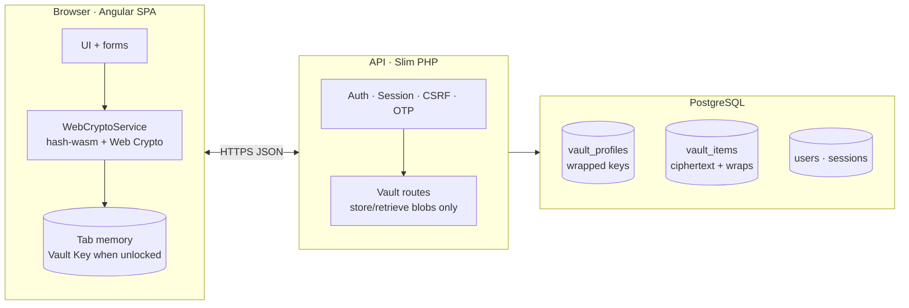
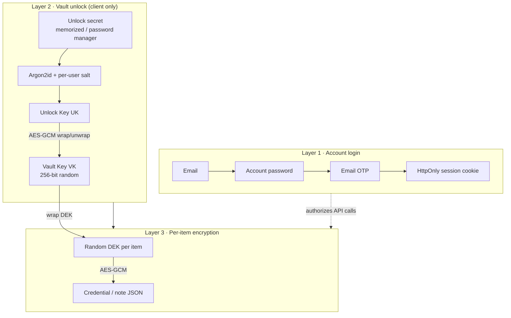
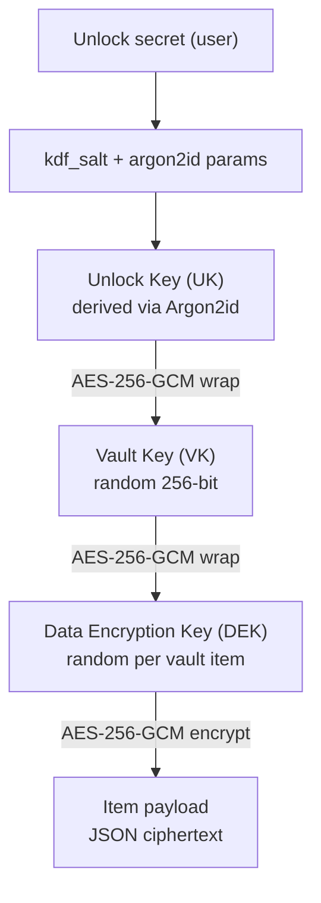
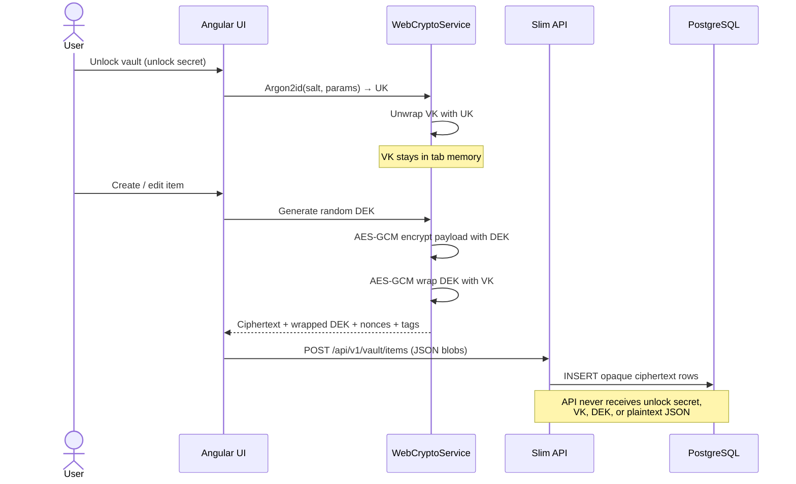
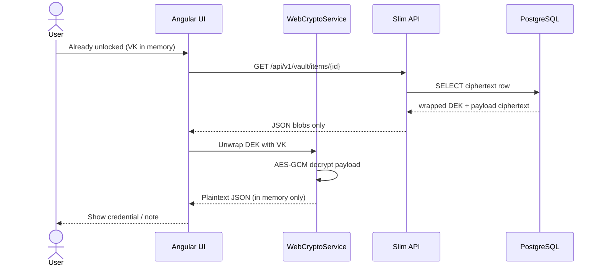
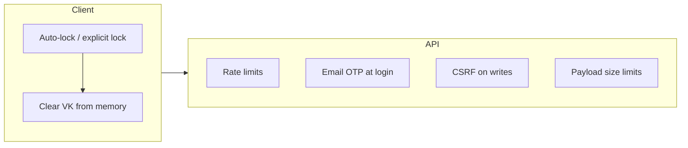

<div align="center">

# Argoned Vault

**Zero-knowledge password & secrets manager — self-hostable, full-featured, MIT licensed.**

*Encrypted client-side · Argon2id · AES-256-GCM · per-item keys*

[Website](https://argoned.com) · [Self-host guide](docs/self-host.md) · [Documentation](docs/README.md) · [Security](SECURITY.md) · [Contributing](CONTRIBUTING.md)

<br>

[](LICENSE)
[](docs/vault-crypto-and-data-lifecycle.md)
[](docs/self-host.md)

<br>

[](ui/)
[](ui/)
[](ui/)
[](api/)
[](api/)
[](api/)

<br>

[](api/tests/)
[](docs/vault-crypto-and-data-lifecycle.md)
[](docs/vault-crypto-and-data-lifecycle.md)

<br>

**Managed service:** [argoned.com](https://argoned.com) — production-hosted Argoned Vault, operated by the team behind this project.

</div>

---

## Overview

**Argoned Vault** is a production-grade, zero-knowledge secrets manager — **MIT licensed** and ready to self-host. This repository contains the vault application: Angular UI, Slim PHP API, platform admin, bulk import, Docker Compose deployment, tests, and technical documentation.

### Also available as a hosted service

You do not have to self-host. **[Argoned](https://argoned.com)** provides the same vault technology as a **managed, production service** — maintained and operated by the Argoned team. Whether you subscribe at [argoned.com](https://argoned.com) or deploy from this repository, the **cryptographic architecture is the same**: client-side encryption, zero-knowledge storage, and per-item keys.

---

## Why the cryptography is built this way

Most password managers claim “encryption.” Argoned is designed so you can **verify** the model: decryption happens **only in your browser**, with **standard algorithms**, **separate login vs vault unlock**, and **per-item keys** so a single compromise does not unwrap your entire vault at once.

| Property | Argoned | Typical weak pattern |
|----------|---------|----------------------|
| **Server sees vault plaintext** | **Never** (zero-knowledge) | Server-side decrypt or “recoverable master key” |
| **Login password = vault key** | **No** — separate unlock secret | One password unlocks everything server-side |
| **Key derivation** | **Argon2id** (memory-hard, per-user salt) | Fast hashes (bcrypt-only UI, MD5-era legacy) |
| **Item encryption** | **AES-256-GCM** (AEAD) + random **DEK per item** | One master key encrypts all rows |
| **Tamper detection** | GCM **authentication tag** on every blob | ECB / unauthenticated modes |
| **Unlock location** | **Web Crypto API** in tab memory | Keys persisted in `localStorage` |
| **Recovery** | Optional **recovery artifact** (second wrap of vault key) | Account reset silently decrypts vault |

**Bottom line:** the API is a **storage and access-control plane** for ciphertext. It validates who you are (session + CSRF + OTP), not what your secrets contain.

> Deep dive: [docs/vault-crypto-and-data-lifecycle.md](docs/vault-crypto-and-data-lifecycle.md) · [docs/architecture-security-and-threats.md](docs/architecture-security-and-threats.md)

---

## System architecture



---

## Three independent secret layers

Argoned deliberately splits **account access** from **vault decryption**. Compromising your login session does **not** automatically decrypt vault items.



| Layer | Stored on server? | Purpose |
|-------|-------------------|---------|
| **Login** | Password hash + session row only | Prove account ownership |
| **Unlock** | Wrapped vault key + KDF params + salt | Zero-knowledge envelope |
| **Per item** | Wrapped DEK + ciphertext + nonces + tags | Limit blast radius per row |

---

## Key hierarchy (technical)



| Symbol | Algorithm | Where it lives |
|--------|-----------|----------------|
| **UK** | Argon2id → AES-256-GCM key material | Derived in browser; never sent plaintext |
| **VK** | Random; wrapped by UK | Wrapped blob in `vault_profiles` |
| **DEK** | Random per item; wrapped by VK | Wrapped blob in each `vault_items` row |
| **Payload** | AES-256-GCM | Ciphertext + IV + auth tag in `vault_items` |

**Recovery lane (optional):** a separate **recovery secret** wraps an copy of VK into `vault_recovery_artifacts` so you can regain vault access if the unlock secret is lost — without the server ever holding plaintext keys.

---

## Encrypt flow (save a vault item)



---

## Decrypt flow (read a vault item)



---

## Trust boundary — what the server can and cannot see

| Data | On server | Server reads plaintext? |
|------|-----------|-------------------------|
| Account password | bcrypt/argon hash in `users` | **No** — verify only |
| Sign-in OTP | Hashed challenge row | **No** |
| Session token | HttpOnly cookie + DB hash | Validity only |
| **Unlock secret** | **Not stored** | **Never** |
| **Vault Key (raw)** | **Not stored** | **Never** |
| Wrapped vault key | `vault_profiles` | Ciphertext + IV + tag only |
| Item plaintext | **Not stored** | **Never** |
| Item ciphertext | `vault_items` | Opaque blobs |
| `item_type` metadata | Plaintext column | **Yes** — category label (e.g. `credential:website`) |
| `searchable_words` | Plaintext tokens | **Yes** — search UX trade-off ([docs](docs/vault-crypto-and-data-lifecycle.md)) |

---

## Cryptographic primitives (as implemented)

| Function | Algorithm / library | Notes |
|----------|---------------------|-------|
| Vault unlock KDF | **Argon2id** via `hash-wasm` | Per-user salt + tunable memory/time |
| Symmetric encryption | **AES-256-GCM** (Web Crypto API) | AEAD — confidentiality + integrity |
| Key wrapping | AES-GCM on VK and each DEK | Random 96-bit IV per operation |
| Recovery wrap | SHA-256 lane + AES-GCM | Separate from Argon2 unlock path |
| Password strength | **zxcvbn** | UX feedback at signup/unlock |
| Transport | TLS (HTTPS) | Session cookie `HttpOnly`, `SameSite=Lax` |
| API writes | CSRF token | `hash_equals` on mutating routes |

---

## Security controls beyond crypto



- **Auto-lock** — vault key cleared from tab memory after idle timeout.
- **Email OTP** — second factor at sign-in (hashed server-side with pepper).
- **CSRF** — mutating API calls require matching session CSRF token.
- **Rate limiting** — auth and recovery endpoints throttled.
- **Separate concerns** — changing account password does **not** re-encrypt vault items automatically.

> Report vulnerabilities privately: [SECURITY.md](SECURITY.md)

---

## Features

| Area | Capabilities |
|------|----------------|
| **Vault** | Credentials, secure notes, cards, identities; categories; search; bulk import (CSV/JSON) |
| **Crypto** | Client-side encrypt/decrypt; profile rotation; recovery artifacts |
| **Auth** | Email + password; sign-in OTP; OAuth (Google, LinkedIn, Facebook); sessions |
| **Admin** | Platform operator dashboard via `ADMIN_EMAIL` |
| **Ops** | Docker Compose dev + production overlay; health checks; Phinx migrations |

---

## Technology stack

| Layer | Technology | Location |
|-------|------------|----------|
| **Vault SPA** | Angular 21+, Tailwind CSS v4, Vitest | [`ui/`](ui/) |
| **API** | Slim 4, PHP-DI, PHP 8.3, PHPUnit 11 | [`api/`](api/) |
| **Database** | PostgreSQL 16+ | [`docker-compose.yml`](docker-compose.yml) |
| **Mail** | Symfony Mailer (SMTP) | [`api/.env.example`](api/.env.example) |
| **Deploy** | Docker Compose v2 | [`docs/self-host.md`](docs/self-host.md) |

**Client crypto:** `hash-wasm` (Argon2id), Web Crypto API (AES-GCM), zxcvbn password strength.

---

## Quick start

**Requirements:** Docker Engine + Compose v2, ~4 GB RAM recommended for first build.

```bash
git clone https://github.com/narwalsandeep/argoned-vault.git
cd argoned-vault
cp api/.env.example api/.env
# Edit api/.env — set DB_PASSWORD, mail, and production URLs as needed
docker compose --env-file ./api/.env up -d --build
```

| Service | Default URL |
|---------|-------------|
| Vault app | http://localhost:3002 |
| API | http://localhost:3003 |

Health checks: `GET /health/live` · `GET /health/ready`

**Production-style deploy** (nginx + PHP-FPM):

```bash
docker compose --env-file ./api/.env \
  -f docker-compose.yml \
  -f docker-compose.prod.yml \
  up -d --build
```

Full instructions: **[docs/self-host.md](docs/self-host.md)**

---

## Configuration

Copy **`api/.env.example`** → **`api/.env`**. Never commit secrets.

| Variable | Purpose |
|----------|---------|
| `APP_ENV` | `production` for real deploys |
| `DB_PASSWORD` | Postgres password |
| `LOGIN_OTP_PEPPER` | Required in production (sign-in email OTP) |
| `UI_ORIGIN`, `API_PUBLIC_BASE_URL` | Public URLs your users hit |
| `MAIL_*` | SMTP for signup, OTP, password reset |
| `ADMIN_EMAIL` | Optional platform admin operator |

Always pass the env file to Compose:

```bash
docker compose --env-file ./api/.env …
```

---

## Testing

| Suite | Command | Scope |
|-------|---------|-------|
| **API (PHPUnit)** | `cd api && composer install && ./vendor/bin/phpunit` | Routes, auth, vault contracts |
| **UI (Vitest)** | `cd ui && npm ci && npm test` | Angular components & services |
| **CI gate** | `.github/workflows/publish-oss.yml` | Builds + API tests before each public release |

The API ships **70+ unit tests** covering auth, OAuth, vault validation, and HTTP middleware.

---

## Documentation

| Document | Description |
|----------|-------------|
| [docs/self-host.md](docs/self-host.md) | Self-hosting from scratch |
| [docs/system-reference.md](docs/system-reference.md) | Routes, tables, import |
| [docs/vault-crypto-and-data-lifecycle.md](docs/vault-crypto-and-data-lifecycle.md) | Cryptography & key hierarchy |
| [docs/security-program-and-hardening-roadmap.md](docs/security-program-and-hardening-roadmap.md) | Security controls & roadmap |
| [docs/account-recovery.md](docs/account-recovery.md) | Recovery flows |
| [docs/architecture-security-and-threats.md](docs/architecture-security-and-threats.md) | Threat model |

Index: **[docs/README.md](docs/README.md)**

---

## Project structure

```
argoned-vault/
├── ui/                 # Vault Angular SPA (Web Crypto + Argon2id)
├── api/                # Slim PHP API + migrations + tests
├── docs/               # Technical documentation
├── docker-compose.yml  # Local / self-host stack (ui, api, db)
├── docker-compose.prod.yml
├── LICENSE             # MIT
├── SECURITY.md
└── CONTRIBUTING.md
```

---

## Contributing

Contributions are welcome. Please read [CONTRIBUTING.md](CONTRIBUTING.md) before opening a PR.

- Bug reports → [GitHub Issues](https://github.com/narwalsandeep/argoned-vault/issues)
- Security → [SECURITY.md](SECURITY.md) (private disclosure)
- No secrets in PRs — CI leak scans reject `.env` and live keys

---

## License

MIT License — see [LICENSE](LICENSE).

**Trademark:** *Argoned* is the product name. MIT grants code use, not unrelated use of the Argoned mark. The managed service is at **[argoned.com](https://argoned.com)**.

---

<div align="center">

**Client-side keys · Per-item AEAD · Self-host anywhere · Own your data**

[⬆ Back to top](#argoned-vault)

</div>
