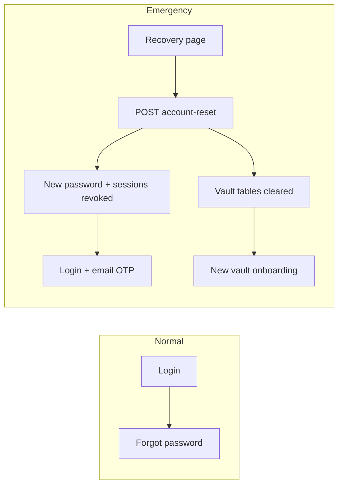

# Account recovery (pre-login emergency lane)

**Audience:** Product, engineers, operators  
**Related:** [vault-crypto-and-data-lifecycle.md](./vault-crypto-and-data-lifecycle.md) (recovery artifacts vs unlock), [architecture-security-and-threats.md](./architecture-security-and-threats.md), [security-program-and-hardening-roadmap.md](./security-program-and-hardening-roadmap.md) (recovery-token risk §3.5), [research-todos-and-backlog.md](./research-todos-and-backlog.md) (future ownership proof).

---

## 1. What users see before login

On the **login** screen, the left panel links include **Recovery** (`/recovery`). **Forgot password** (`/forgot-password`) is the default path when the user only needs to reset the **account password** and keep vault data.

**Account recovery** is an **emergency, account-level** path for when cryptographic recovery material is not usable and the user still needs to **regain login** to the product. It must not be confused with:

| Flow | Purpose | Vault data |
|------|---------|------------|
| **Forgot password** | Prove email access; set a new account password via emailed reset link | **Preserved** (server ciphertext unchanged) |
| **Account recovery** | Last-resort **account** reset with explicit acceptance of vault data loss on the server | **Server-side vault rows cleared** for that user (see §3) |

Copy on `/recovery` should continue to steer typical users to **Forgot password** and reserve this form for the emergency case.

---

## 2. How it should work (product rules)

1. **Separation of concerns**  
   **Login** (email + password + email OTP) is independent of **vault unlock** (unlock secret in the client). Account recovery only resets **login credentials** and **server-stored vault domain data**; it does not decrypt or “recover” vault plaintext.

2. **Explicit data-loss consent**  
   The user must confirm they understand that **without** a working **unlock secret** and **recovery / emergency material**, old vault ciphertext cannot be opened. This is a **checkbox** requirement before submit (`confirm_data_loss`).

3. **No silent decryption**  
   The server must **not** claim to restore old vault contents. After recovery, the account may onboard a **new** vault profile. This matches the zero-knowledge rule: the server never had plaintext; after reset it should not retain old ciphertext that could confuse users into thinking data is recoverable from the server alone.

4. **Generic success messaging**  
   Responses should avoid confirming whether an email is registered (enumeration). The API uses a single neutral success message when validation passes (see §4).

5. **Strong identity proof (target)**  
   **Today:** the HTTP handler is gated by a **shared break-glass token** (see §4), suitable for controlled/operator use—not a substitute for end-user email proof.  
   **Target:** replace or supplement with **ownership proof** (e.g. signed, time-limited challenge, email OTP with replay protection) as tracked in [research-todos-and-backlog.md](./research-todos-and-backlog.md).

6. **Rate limiting**  
   The recovery account-reset route should stay under **abuse limits** (`RATE_LIMIT_RECOVERY_MAX` / recovery window in API settings).

---

## 3. What the server does today (as implemented)

When `POST /api/v1/auth/recovery/account-reset` succeeds for a known user, `UserRepository::resetAccountOnlyRecovery` runs in a transaction roughly as follows:

1. Revoke **auth sessions** for the user (`auth_sessions.revoked_at`).
2. Delete **`vault_items`** for the user.
3. Delete **`vault_profiles`** for the user.
4. Delete **`vault_recovery_artifacts`** for the user.
5. Set a new **Argon2id** password hash on **`users`**, set **`mfa_enabled`** / **`mfa_state`** so subsequent login uses the normal **email OTP** path (`email_otp`).
6. Write an **`audit_events`** row with `event_type` = `account_recovery_reset` and metadata noting vault data cleared.

If no user exists for the email, the repository returns without throwing; the HTTP layer still responds with the same generic success payload (enumeration-resistant behavior depends on this staying consistent).

**Important:** Clearing `vault_profiles` / `vault_items` removes **server-side** ciphertext the app relied on. Any **local-only** or **exported** backups are outside this transaction.

---

## 4. API contract (operators + client authors)

| Item | Detail |
|------|--------|
| **Route** | `POST /api/v1/auth/recovery/account-reset` |
| **Feature gate** | `ACCOUNT_RECOVERY_ENABLED=true` in API env; otherwise `403` with `account_recovery_disabled`. |
| **Auth to the endpoint** | Header **`X-Account-Recovery-Token`** must **`hash_equals`** the configured `ACCOUNT_RECOVERY_TOKEN` (non-empty). Mismatch or missing → `401` `unauthorized`. |
| **Body (JSON)** | `email`, `new_password` (min 8 chars), `confirm_data_loss` (must be true). |
| **Success** | `200` with `status: ok`, `account_reset: true`, `vault_data_recoverable: false`, and a fixed **message** string (see `AccountRecoveryResetAction`). |
| **Validation errors** | `422` `invalid_recovery_request` (e.g. missing confirmation, bad email). |

**Operational note:** The recovery token is a **high-value secret**. It must **not** be baked into public front-end bundles. Break-glass use is expected via **controlled channels** (internal tool, `curl` from a trusted host, or a future in-product flow that does not expose the operator token to browsers).

**UI note:** The public Angular **Recovery** page collects email/password/consent and calls the same path; for the endpoint to succeed when gated, whatever **deployed** client hits the API must attach **`X-Account-Recovery-Token`** in line with your security model (usually **not** from an untrusted browser for production).

---

## 5. User journey (intended)

1. User opens **Recovery** from login (or from copy on forgot-password).
2. User reads warning; uses **Forgot password** if they only lost the password.
3. If proceeding: enter email, new password, check data-loss confirmation, submit.
4. After success: sign in with the **new password** and complete **email OTP**; complete **vault onboarding** as for a new cryptographic profile.

---

## 6. Configuration reference

| Variable | Role |
|----------|------|
| `ACCOUNT_RECOVERY_ENABLED` | Master switch for the route. |
| `ACCOUNT_RECOVERY_TOKEN` | Shared secret for `X-Account-Recovery-Token`. |
| `RATE_LIMIT_RECOVERY_MAX` / window | Abuse throttle for recovery POSTs (see `AbuseProtectionMiddleware`). |

See `vault/api/.env.example` for placeholders.

---

## 7. Changelog discipline

If the gate, body fields, side effects on tables, or success semantics change, update this file and [system-reference.md](./system-reference.md) in the same change.
