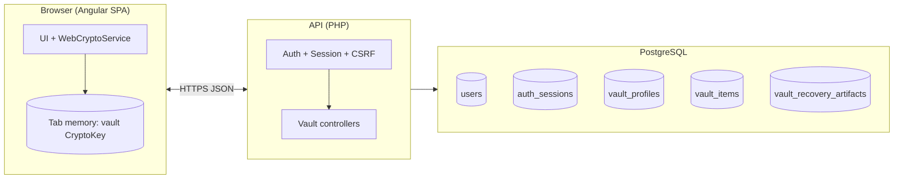
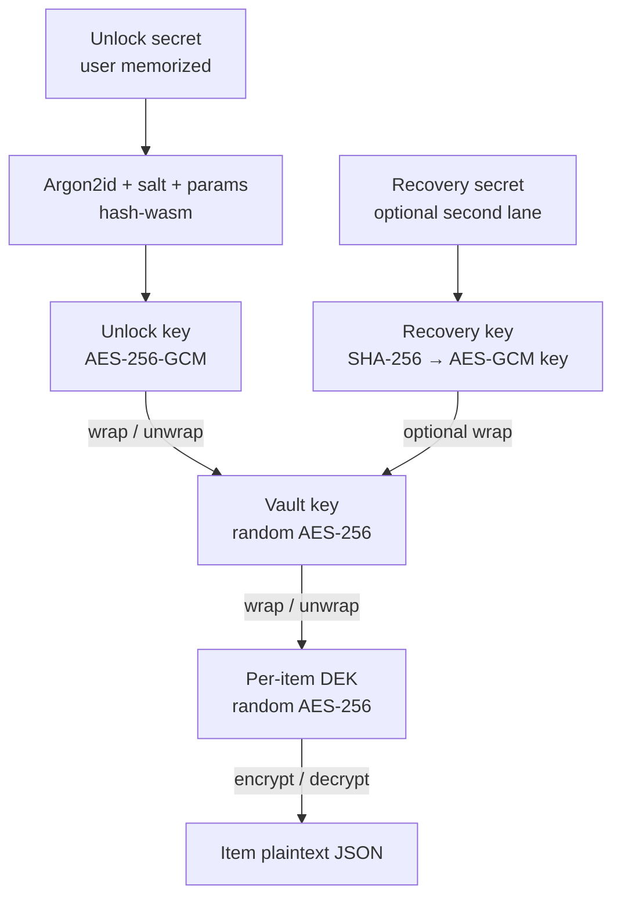
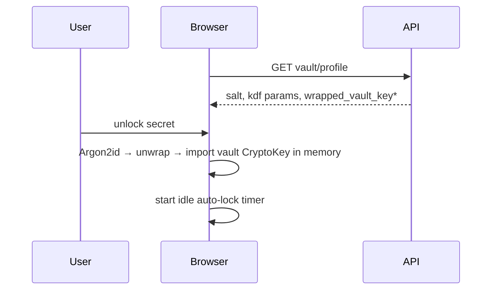
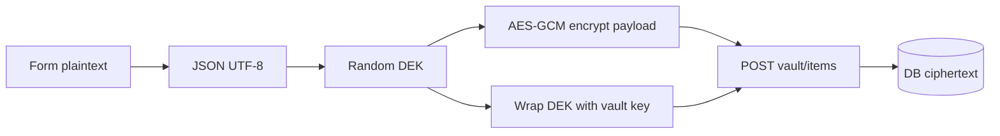
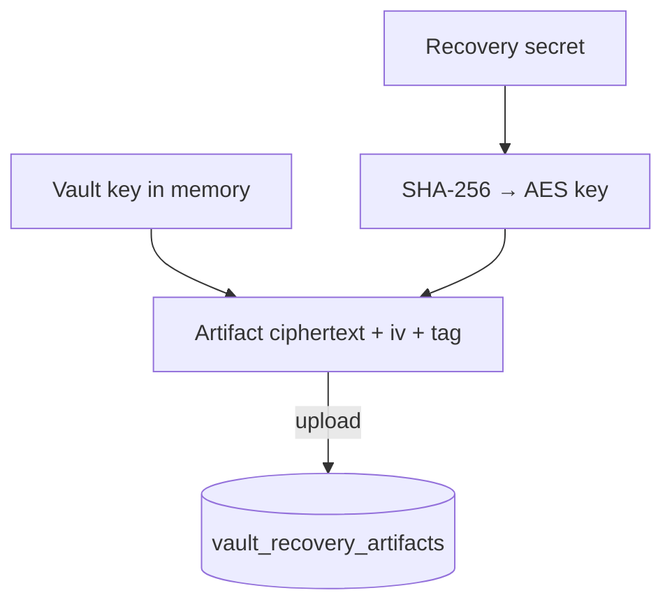

# Security, architecture, and client-side threats

**Audience:** Security engineering, architects, technical leadership, compliance stakeholders  
**Scope:** Security properties and data flows **as implemented** (Angular SPA + PHP API + PostgreSQL), plus **browser extension / shared-browser** considerations.  

**Primary roadmap (residual risks, backlog, remediation):** [security-program-and-hardening-roadmap.md](./security-program-and-hardening-roadmap.md)  

**Companion:** [system-reference.md](./system-reference.md) for routes and schema; [vault-crypto-and-data-lifecycle.md](./vault-crypto-and-data-lifecycle.md) for field semantics.

---

## 1. Executive summary (for leadership)

| Topic | Position |
|--------|----------|
| **Vault confidentiality** | Item plaintext and vault master key material are **encrypted in the browser** before upload. The API stores **ciphertext, IVs, and authentication tags**; it does **not** perform vault decryption. |
| **Authentication** | Users authenticate with **email + account password**, then **email OTP** to complete session issuance. Sessions use an **HttpOnly, SameSite=Lax** cookie; mutating API calls require a **CSRF token** validated with `hash_equals`. |
| **Separation of concerns** | **Account login password** ≠ **vault unlock secret**. Changing the login password does not rotate vault ciphertext keys. |
| **Crypto algorithms** | **Argon2id** (`hash-wasm` in the browser) for vault unlock key derivation; **AES-256-GCM** (Web Crypto API) for wrapping and item payloads; per-item random **DEKs**. |
| **Recovery** | Optional **recovery secret + recovery artifact** wraps the vault key under a key derived from the recovery secret (**SHA-256 → AES-GCM** in client code). Loss of all user-held secrets can mean **permanent data loss** (by design for zero-knowledge). |
| **Client exposure** | Vault key exists in **tab memory** only while unlocked; **auto-lock** and explicit lock clear it. **Other browser tabs do not share** the in-memory key. |
| **Account step-up** | **Email OTP at sign-in** is the current step-up (`auth_login_email_otp_challenges`). **TOTP / WebAuthn** remain backlog items ([security-program-and-hardening-roadmap.md](./security-program-and-hardening-roadmap.md)). |

**Plain language:** The server is a **storage and access-control plane** for encrypted blobs. **Secrets that decrypt the vault are not required on the server** if users follow the intended flows.

---

## 2. System context



---

## 3. Trust boundaries & data classification

| Data class | Typical location | Server can read? |
|------------|------------------|------------------|
| Account password | Hashed in `users` | **No** (only verification) |
| Session token | HttpOnly cookie + hash in `auth_sessions` | **Session validity only** |
| Vault unlock secret | User memory / password manager | **No** (not stored) |
| Vault key (raw) | Browser `CryptoKey` when unlocked | **No** |
| Wrapped vault key | `vault_profiles` | **Yes** (ciphertext + IV + tag) |
| Item plaintext JSON | Browser only when unlocked | **No** |
| Item ciphertext + wraps | `vault_items` | **Yes** (opaque blobs) |
| `searchable_words` | `vault_items` | **Yes** — **plaintext tokens** for search UX (metadata leak by design) |
| CSRF token | Response body + session row | **Yes** (must match header on writes) |

---

## 4. Cryptographic architecture (as implemented)

### 4.1 Key hierarchy



**Implementation references:** `ui/src/app/core/vault/web-crypto.service.ts` — `bootstrapVaultProfile`, `unlockVaultFromProfile`, `encryptCredentialItem` / `encryptVaultItem`, `decryptItemPayload`, `buildRecoveryArtifact`, `unlockFromRecoveryArtifact`.

### 4.2 Algorithms & parameters (defaults in code)

| Step | Algorithm | Notes |
|------|-----------|--------|
| Unlock key derivation | **Argon2id** | Defaults in `VAULT_ARGON2_DEFAULTS`; tunable on onboarding within `VAULT_ARGON2_LIMITS`. |
| Wrapping / payloads | **AES-256-GCM** | 12-byte nonce per operation. |
| Recovery key | **SHA-256** of UTF-8 secret → import as AES-GCM key | Separate from Argon2id unlock path. |
| Item typing | `item_type` e.g. `credential:website` | Drives UI; does not change cipher suite. |
| Versioning | `crypto_version: 1` | On profile and items for forward-compatible rotation. |

### 4.3 Item envelope (logical)

```
vault_key  --AES-GCM-->  wraps  DEK (random per item)
DEK        --AES-GCM-->  encrypts  payload JSON (UTF-8)
```

---

## 5. Security-relevant flows

### 5.1 Account login & session (API)

Session cookie **`HttpOnly; SameSite=Lax`**, optional **`Secure`** in production (`SESSION_SECURE_COOKIE`, cookie factory in API).

```mermaid
sequenceDiagram
  participant B as Browser
  participant A as API
  participant D as DB
  participant M as Mail
  B->>A: POST /api/v1/auth/login (email, password)
  A->>D: verify password + verified email; store OTP challenge (hashed)
  A->>M: send 6-digit OTP
  A-->>B: 200 JSON { mfa_challenge_token, expires_in_seconds }
  B->>A: POST /api/v1/auth/login/email-otp (challenge, otp)
  A->>D: verify OTP; create auth_sessions row
  A-->>B: 200 JSON { csrf_token, user } + Set-Cookie bb_session=...
```

### 5.2 Authenticated request with CSRF (mutations)

`AuthMiddleware` validates session and `hash_equals` on CSRF for `POST`, `PUT`, `PATCH`, `DELETE`.

### 5.3 Vault profile bootstrap (first-time client crypto)

```mermaid
sequenceDiagram
  participant U as User
  participant C as Browser crypto
  participant A as API
  U->>C: unlock secret + Argon2 params
  C->>C: Argon2id → unlock key; generate vault key; wrap VK
  C->>A: PUT vault/profile (wrapped blob only, CSRF)
  A->>A: store ciphertext fields
```

### 5.4 Unlock vault (subsequent visits)



### 5.5 Create encrypted item



### 5.6 Recovery artifact (optional)



---

## 6. Threat modeling (concise)

| Threat | Mitigation (design / implementation) | Residual risk |
|--------|--------------------------------------|---------------|
| **DB breach** | Attacker gets ciphertext, wrapped keys, salts; still needs unlock/recovery secrets | **High** effort if secrets are strong |
| **API compromise** | Same as DB for vault data; session forgery still needs cookie + CSRF for writes | Operational controls, WAF |
| **XSS in SPA** | If attacker runs JS in origin, **vault key in memory and DOM** are at risk | CSP on API responses; SPA build hygiene, audits |
| **Session theft** | HttpOnly reduces JS theft; SameSite=Lax; HTTPS + Secure in prod | Malware, XSS |
| **CSRF** | Double-submit: cookie session + `X-CSRF-Token` | Misconfigured CORS / origins |
| **Weak user secrets** | Minimum length 12 on unlock secret (client policy) | User behavior |
| **Lost secrets** | No server-side decrypt of old data without keys | **Permanent lockout** of plaintext |

---

## 7. API & transport hardening (implemented)

| Control | Detail |
|---------|--------|
| **CORS** | `UI_ORIGINS` / `UI_ORIGIN` in `settings.php` |
| **Security headers** | `SecurityHeadersMiddleware`: nosniff, frame deny, referrer-policy, permissions-policy, CSP on API JSON, CORP |
| **Request size** | `MAX_REQUEST_BYTES` (~1 MiB default) |
| **Rate limits** | Auth and recovery windows (`RATE_LIMIT_*`) |
| **Account passwords** | Argon2id via PHP `password_*` |

---

## 8. Limitations & production checklist

Canonical **residual risks**, **prioritized remediation**, and **release backlog**: **[security-program-and-hardening-roadmap.md](./security-program-and-hardening-roadmap.md)**.

Brief reminders: enable **`SESSION_SECURE_COOKIE`** with HTTPS; confirm **no plaintext vault fields** in logs; independent penetration test before enterprise assertions.

---

## 9. Browser extensions, in-browser vaults, and honest comparisons

**Disclaimer:** Educational threat-model material—not a penetration test, certification, or legal advice.

### 9.1 What “encryption in the tab” does and does not mean

The vault derives and uses keys **inside the browser**. That protects **ciphertext at rest** on the server and **TLS-only network attackers**. It does **not** prove that **no other code** in the browser profile can observe **plaintext after decrypt**, **keys in memory**, or **keystrokes** while typing secrets.

**Key insight:** Cryptography protects data **at rest and in transit** against many classes of attacker. It does not, alone, remove **endpoint** risk from **malicious or over-privileged browser extensions** or **OS malware**.

### 9.2 Why extensions matter for any web vault

Depending on manifest permissions, extensions may read or modify **DOM**, observe **network** traffic, use **storage**, and interact with **cookies** (subject to APIs and site rules). Industry references:

- [OWASP Browser Extension Vulnerabilities Cheat Sheet](https://cheatsheetseries.owasp.org/cheatsheets/Browser_Extension_Vulnerabilities_Cheat_Sheet.html)
- [Chrome extension security](https://developer.chrome.com/docs/extensions/mv3/security/)
- [MDN WebExtensions security best practices](https://developer.mozilla.org/en-US/docs/Mozilla/Add-ons/WebExtensions/Security_best_practices)

Practical attacks target **sessions**, **keystrokes**, **DOM**, **clipboard**, **injected page script**, or **extension messaging**—not AES ciphertext alone.

### 9.3 Repository-specific surface

| Area | Extension / malware relevance |
|------|--------------------------------|
| **Vault unlock secret** | Typed or pasted in SPA; exists in tab memory while unlocked. |
| **Account session** | HttpOnly cookie reduces **page-script** theft; extension threat model differs. |
| **CSRF** | Helps cross-site request forgery; does not neutralize **malware acting as the user**. |
| **Per-item ciphertext** | Minimizes exposure until decrypt; **plaintext** exists where the UI places it. |
| **`searchable_words`** | Plaintext **search hints** by design—any compromised client or insider process could misuse them. |

**Bottom line:** Strong crypto can coexist with a **shared browser profile** trust zone that includes user-installed extensions.

### 9.4 What engineering can and cannot promise

**Cannot promise (pure web app):** blanket statements like “no extension can read my vault.”

**Can improve:** CSP, dependency hygiene, minimize secrets in DOM, SRI/pinned builds, short sessions, re-auth for sensitive operations, documented **vault-only browser profile** guidance for users.

**Larger roadmap ideas (not all implemented):** desktop shell (Electron/Tauri) with reduced extension surface; WebAuthn for **account** phishing resistance; security monitoring for API abuse.

### 9.5 User guidance (help-center ready)

1. Use a **dedicated browser profile** for the vault with **minimal extensions**.  
2. Avoid extensions with **broad site access** unless fully trusted.  
3. Remove unused extensions; treat updates as **security events**.  
4. Keep browser and OS patched.  
5. Unlocking on a **compromised machine** can expose plaintext—risk is about **probability and detectability**, not mathematics alone.

### 9.6 Maintainer communication norms

- Never promise “extensions cannot affect this app.”  
- **Do** promise what crypto covers (server/DB operator blind to plaintext) plus concrete controls (CSRF, cookies, rate limits).  
- Track residual work in [security-program-and-hardening-roadmap.md](./security-program-and-hardening-roadmap.md) and [research-todos-and-backlog.md](./research-todos-and-backlog.md).

---

*This document is descriptive of the codebase at authoring time. It is not a warranty or certification.*
