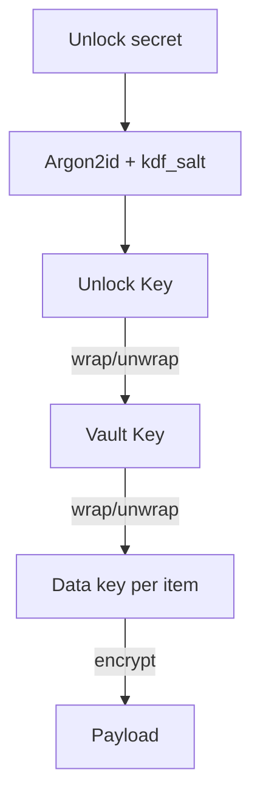

# Vault cryptography, fields, and data lifecycle

**Audience:** Engineers and advanced operators  
**Companion:** [system-reference.md](./system-reference.md) for routes and tables; [architecture-security-and-threats.md](./architecture-security-and-threats.md) for threat framing; [security-program-and-hardening-roadmap.md](./security-program-and-hardening-roadmap.md) for metadata/search residual risks (§3.4).

---

## 1. As-built vs product vision

| Topic | **As implemented today** | **Original blueprint** (historical target) |
|-------|---------------------------|---------------------------------------------|
| Vault unlock | Single **unlock secret** (≥12 chars), Argon2id → **Unlock Key (UK)** | PIN + passphrase + **Secret Key** combined into KDF input |
| Onboarding | `OnboardingWizardComponent` + `WebCryptoService.bootstrapVaultProfile` | Multi-field wizard with printed Secret Key |
| Crypto path | UK wraps **Vault Key (VK)**; per-item **DEK**; AES-256-GCM throughout | Same hierarchy—design aligned, UX simplified |

The **cryptographic shape** on the server (wrapped VK, wrapped DEKs, AEAD payloads) matches the multi-field vision; **user-facing factors** differ until product adds optional Secret Key / PIN layers.

---

## 2. Three layers of secrets (plain language)

| Layer | Purpose | Implementation |
|-------|---------|----------------|
| **Login** | Prove account ownership | Email + **account password** → email OTP → `auth_sessions` cookie |
| **Vault unlock** | Derive keys for ciphertext | **Unlock secret** + profile salt + Argon2id → UK → unwrap VK |
| **Per item** | Limit scope of decryption | Random DEK per row, wrapped by VK |

**Recovery** adds a **second wrap** of VK under a **recovery secret** (SHA-256 lane in client), stored as `vault_recovery_artifacts`.

---

## 3. Key hierarchy (technical)

| Term | Meaning |
|------|---------|
| **UK** | Symmetric key from Argon2id(unlock secret, salt, params) |
| **VK** | Random 256-bit vault key; exists in memory when “unlocked” |
| **DEK** | Random per-item key |
| **Recovery key** | Derived from recovery **secret** (separate from Argon2 UK path) |

---

## 4. Vault profile fields (`vault_profiles`)

**API:** `POST` / `PUT` `/api/v1/vault/profile` (upsert), `GET` `/api/v1/vault/profile`.

| Field | Role |
|-------|------|
| `kdf_algo` | e.g. `argon2id` |
| `kdf_params_json` | Argon2 time / memory / parallelism |
| `kdf_salt` | Per-user salt (public, random) |
| `wrapped_vault_key` + `_nonce` + `_tag` | VK wrapped by UK |
| `crypto_version` | Protocol version |
| `vault_initialized_at` | Audit / UX timestamp |

---

## 5. Vault item fields (`vault_items`)

**API:** `POST /vault/items`, `GET|PUT|DELETE /vault/items/{id}`, bulk `POST /vault/items/bulk`.

| Field | Role |
|-------|------|
| `item_type` | **Plaintext metadata** (e.g. `credential:website`); drives UI |
| `label_ciphertext` | Optional encrypted label |
| `wrapped_dek` + nonce + tag | DEK wrapped by VK |
| `payload_ciphertext` + nonce + tag | AEAD payload |
| `crypto_version` | Item format version |
| `import_batch_id` | Optional UUID correlating an import batch |
| `searchable_words` | **Plaintext search tokens** (privacy trade-off) |
| `display_number` | Per-user stable `#` for UX |
| `deleted_at` | Soft delete |

---

## 6. Recovery artifacts (`vault_recovery_artifacts`)

**API:** `POST /vault/recovery/artifact`, `GET /vault/recovery/artifact`, `POST /vault/recovery/rotate-unlock-material`.

| Field | Role |
|-------|------|
| `artifact_type` | e.g. recovery wrap kind |
| `wrapped_vault_key_recovery` + `nonce` + `tag` | VK wrapped under recovery key |
| `revoked_at` | Prior rows invalidated on rotation |

---

## 7. Profile regeneration vs existing items

**Critical behavior (implemented):** Saving a **new** vault profile through bootstrap **generates a new VK** and new salt/wrap. The server stores **one** profile row per user. Existing `vault_items` ciphertext remains valid for the **old** VK, but the client after unlock holds only the **new** VK → **old items fail to decrypt** (access loss, not DB corruption).

| Scenario | Outcome |
|----------|---------|
| First setup, add items | Normal. |
| Regenerate profile with new secret | New VK₂; items encrypted under VK₁ **do not decrypt**. |
| “Same” passphrase string again | Still new VK unless code explicitly re-wraps same VK (**not** current behavior). |
| Change only Argon2 sliders then save | Still runs bootstrap path → **new VK** → same as above. |
| Old recovery artifact wrapping VK₁ while profile shows VK₂ | In principle VK₁ could be recovered from artifact for **read** of legacy items; product expects **new artifact** after rotation—avoid mixed states without a migration plan. |
| Multi-device | One server profile; whichever device last saved profile wins. |

**Operational rule:** Before profile regeneration, use **export**, **recovery testing**, or a planned **re-encryption migration** if old data must survive.

---

## 8. Account-only recovery

`POST /api/v1/auth/recovery/account-reset` (feature-gated, token header) resets **account access**; it does **not** decrypt old vault rows without cryptographic recovery material. Messaging must stay explicit: **old ciphertext may be removed or orphaned** per product policy.

---

## 9. FAQ

**Why multiple nonce+tag pairs?** Each distinct AEAD operation (wrap VK, wrap DEK, encrypt payload) needs its own nonce and produces its own tag.

**Why is `item_type` not encrypted?** Routing and list UX; see metadata privacy notes in architecture doc.

**Can the server decrypt passwords?** No, if clients never send UK, VK, DEK, or recovery secrets. Server validates structure only (`VaultContractValidator`).

---

*Aligned with migrations under `api/migrations/` and `WebCryptoService`.*
